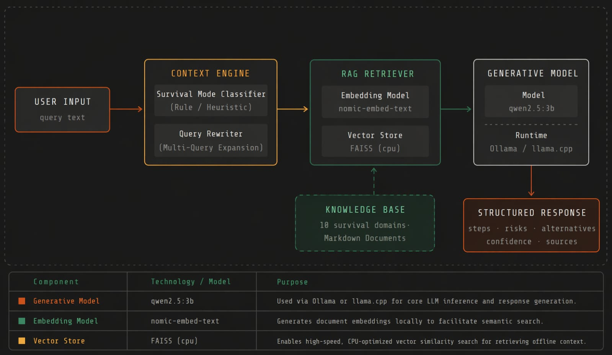
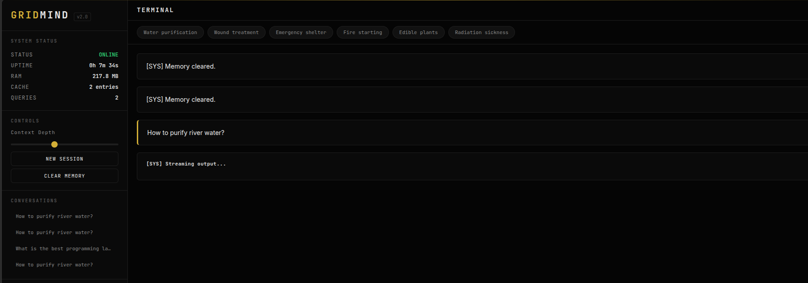
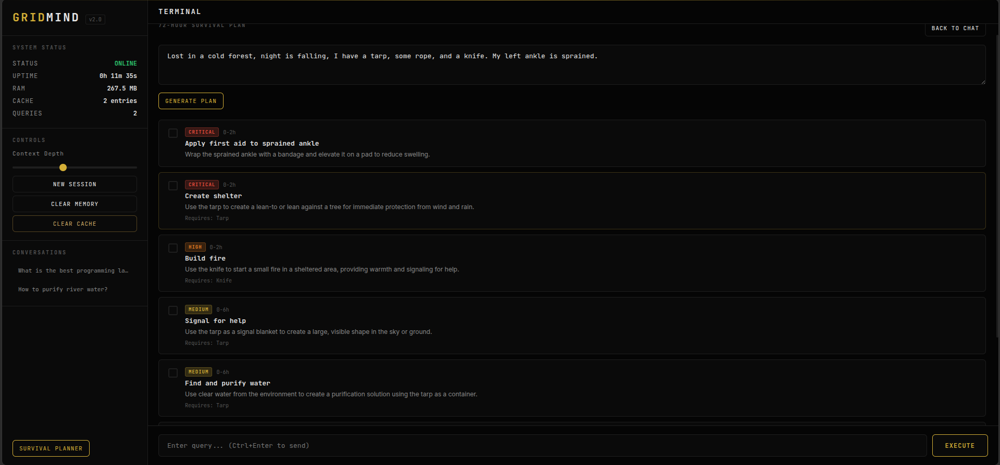
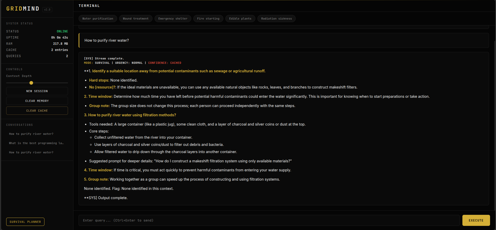

# GridMind: Intelligence When the Grid Fails

[](https://python.org)
[](https://ollama.com)
[](https://github.com/facebookresearch/faiss)
[](https://fastapi.tiangolo.com)
[](https://developer.mozilla.org/en-US/docs/Web/Progressive_web_apps)
[](LICENSE)

**GridMind** is a fully offline, self-contained AI Operating System designed for high-stress post-collapse, emergency, and disaster scenarios. When the power grid fails and the internet goes dark, GridMind runs locally on standard consumer CPUs (including edge devices and single-board computers) to serve survival-critical knowledge without external dependencies. 

Unlike standard cloud-dependent chat assistants, GridMind is a production-grade, resource-optimized retrieval-augmented generation (RAG) product designed to run locally on devices with as little as 4GB to 8GB of RAM. The system is engineered from the ground up for resilience, minimal power consumption, and zero external API reliance.

---

## System Architecture

GridMind uses a highly optimized hybrid-retrieval pipeline combined with a deterministic relevance gate to protect limited edge CPU resources from hallucination and wasteful iterative generation loops.



### Core Data Flow
1. **Query Decomposer**: Parses and decomposes complex user inputs into dense (semantic) and sparse (keyword-based) sub-queries, improving retrieval recall.
2. **Hybrid Retrieval**: Queries a BM25 sparse index and a CPU-optimized FAISS dense index in parallel to capture both exact matches and semantic intent.
3. **Reciprocal Rank Fusion (RRF)**: Merges sparse and dense search results using rank-based reciprocal score pooling to create a unified, highly relevant context window.
4. **Relevance Gate**: Implements a deterministic check measuring semantic distance and keyword overlap. If a query is out-of-domain (e.g., general chit-chat or irrelevant requests), it is rejected instantly *before* hitting the LLM. This saves critical CPU cycles and battery life.
5. **Context Synthesizer**: Appends structured operational procedures, concept maps, and session history before passing the context to the quantized LLM for generation.

---

## Product Interface & User Experience

GridMind features a high-contrast, low-power **Tactical Brutalist Dashboard** built to render perfectly on ruggedized tablet screens, mobile phones (via local LAN), or e-ink monitors where visibility in high-glare or low-light situations is critical.

<div align="center">
  
</div>

### Key UI Capabilities
* **Progressive Web App (PWA) Capability**: Can be added directly to mobile home screens for seamless offline usage in the field.
* **Streaming Responses**: Uses Server-Sent Events (SSE) to render markdown responses token-by-token, providing immediate feedback on slow edge hardware.
* **Instant State-Management**: Start a new session or perform a full physical memory purge (deleting conversation history and vector DB tables) with a single click to maintain operational security.
* **System Health Telemetry**: Real-time monitoring of RAM consumption, query logs, cache hits, and backend service health directly on the sidebar.

<div align="center">
  <table>
    <tr>
      <td width="50%" align="center">
        <b>Survival Planner Mode</b><br/>
        
      </td>
      <td width="50%" align="center">
        <b>Low-Power Mobile View</b><br/>
        
      </td>
    </tr>
  </table>
</div>

---

## Key AI/ML Engineering & Optimization Features (Interview Talking Points)

GridMind serves as an excellent demonstration of applied Machine Learning Engineering, specifically focusing on constraints-driven development, edge AI, and optimized retrieval systems. When discussing this project in technical interviews, focus on the following implementations:

### 1. Hybrid Search & Reciprocal Rank Fusion (RRF)
To ensure reliable information retrieval across highly technical manuals, the pipeline merges dense semantic embeddings (`nomic-embed-text`) with BM25 keyword matching. 
* **Challenge**: Pure semantic search often misses exact part numbers or specific medical terminology, while pure keyword search fails on synonyms.
* **Solution**: Results are combined using RRF:
  $$RRF(d) = \sum_{m \in M} \frac{1}{k + r_m(d)}$$
  This preserves both broad concept matches (semantic) and precise product/part codes (lexical), resulting in a more robust retrieval baseline.

### 2. High-Performance Edge Optimizations
Operating on edge CPUs requires strict memory and compute management:
* **Memory-Mapped Vectors (`IO_FLAG_MMAP`)**: The FAISS index is loaded directly into virtual memory. This avoids loading massive raw floating-point tensors into resident memory, preventing out-of-memory (OOM) kills on 4GB RAM devices.
* **Lazy Document Loading**: Vector metadata does not load raw text into RAM; document chunks are fetched from disk on-demand only after search indices yield target IDs.
* **Asynchronous Event Offloading**: To prevent synchronous LLM generation from locking the FastAPI event loop, all blocking operations (embedding calls, DB queries, LLM pings) are executed inside isolated thread pools via FastAPI routing.

### 3. Dual-Layer Semantic Cache (LRU + SQLite Cosine Sim)
To minimize redundant and costly LLM inferencing, a custom caching layer was built:
* **LRU Cache**: Keeps the most frequent queries and their corresponding embeddings in fast in-memory storage.
* **Persistent SQLite Cache**: Stores query embeddings in a local database for cross-session persistence.
* **Cosine Similarity Matcher**: Incoming queries are vectorized and compared against cached queries. If the similarity is above `0.92`, the cached answer is returned in `< 10ms`, bypassing the LLM entirely and saving massive compute time.

### 4. Hardened Relevance Gating
To prevent model hallucinations on topics outside the survival knowledge base, and to prevent wasting CPU cycles on irrelevant queries:
* **Vector Distance Guard**: Rejects queries with FAISS distance $> 1.0$.
* **Keyword Overlap Guard**: Filters out stopwords and verifies that at least $25\%$ of query tokens overlap with the retrieved context.
* **Deterministic Fallback**: If the gate fails, a pre-computed generic response is returned instantly.

---

## Customization Guide

GridMind is highly modular and designed to be customized for different domains beyond emergency preparedness.

### Modifying the Knowledge Base
To swap out the core survival knowledge for a different domain (e.g., legal documents, medical textbooks, or proprietary corporate manuals):
1. **Clear Existing Data**: Delete the contents of the `raw_docs/` directory and the generated `vector_db/` folder.
2. **Add New Documents**: Place your target PDF, TXT, or Markdown files into `raw_docs/`.
3. **Re-Index**: Run the ingestion script: `python main.py index` to rebuild the FAISS and BM25 indices.

### Adjusting System Prompts
The core persona and response styling of the LLM can be tuned by modifying the system prompt templates. You can adjust:
* **Tone**: Shift from a tactical, urgent tone to a more academic or instructional tone.
* **Formatting**: Instruct the LLM to output specific JSON structures or specialized markdown tables.

### UI Theming
The frontend is built with vanilla CSS variables for easy theming. Modify the CSS variables (e.g., `--primary-color`, `--background-color`) in your stylesheets to transition away from the Tactical Brutalist theme to a corporate or dark-mode theme.

---

## Testing & Evaluation Procedure

GridMind includes a comprehensive automated local evaluation framework to benchmark retrieval quality, gate classification accuracy, and system overhead.

### Running the Test Suite
You can execute the entire evaluation suite locally to verify the pipeline's integrity and performance under load:
```bash
python evaluate.py
```

### Writing Custom Tests
To expand the evaluation suite for a customized knowledge base:
1. Open `evaluate.py`.
2. Locate the ground-truth dictionary or evaluation dataset array.
3. Add new query-context pairs that reflect your domain.
4. Run the suite to measure precision, recall, and MRR (Mean Reciprocal Rank).

### Manual Component Testing via CLI
Test individual backend modules directly from your terminal to isolate issues or verify changes:
```bash
# 1. Ask a question locally in the terminal (Full Pipeline)
python main.py ask "how to treat a burn"

# 2. Retrieve top matches for a query (Retrieval Only - No LLM generation)
python main.py retrieve "water purification" --top-k 5

# 3. View concept graph matching (Debug Mode)
python main.py ask "winter shelter" --debug
```

### Typical CPU Benchmark Metrics (Local qwen2.5:3b)
| Benchmark Metric | Performance | Detail |
|---|---|---|
| **Retrieval Latency** | `~0.012s` | Combined BM25 + FAISS search on typical dataset |
| **Domain Precision** | `100.0%` | Expected domain chunks found in Top-5 results |
| **Mean Reciprocal Rank (MRR)** | `0.933` | Target context rank distribution |
| **Relevance Gate Accuracy** | `100.0%` | Correctly blocks 100% of out-of-scope test queries |
| **Idle System RAM** | `~210 MB` | Python process heap size before loading models |
| **Active Inference Speed** | `~2.2 tokens/sec` | Execution on 4x Intel CPU cores |

---

## Quick Setup & Reproducibility

### Prerequisites
* **Python**: `3.10+`
* **Ollama**: Local instance running.
* **Hardware**: Minimum 4GB RAM. SSD recommended for faster index retrieval.

### 1. Installation
```bash
# Clone the repository
git clone https://github.com/A-Square8/GRIDMIND-Intelligence-When-the-Grid-Fails.git
cd GRIDMIND-Intelligence-When-the-Grid-Fails

# Create virtual environment
python3 -m venv venv
source venv/bin/activate

# Install required dependencies
pip install -r requirements.txt
```

### 2. Setup Models
Ensure Ollama is running in the background, then pull the required embedding and generation models:
```bash
ollama pull qwen2.5:3b
ollama pull nomic-embed-text
```

### 3. Ingestion & Indexing
Build the vector database index. This scans the `raw_docs/` directory for text data, chunks it, and builds both the FAISS index and the BM25 lookup dictionary.
```bash
# Full indexing run (clears old indices)
python main.py index

# Incremental run (checks only new documents in raw_docs/)
python main.py index --incremental
```

### 4. Launching the OS Server
Start the backend FastAPI server:
```bash
python interface/server.py
```
Open **`http://localhost:8000`** on any local browser. 

To connect a phone or field tablet to the server, ensure devices are on the same LAN, and enter the host machine's IP address in the mobile browser (e.g., `http://192.168.1.50:8000`).

---

